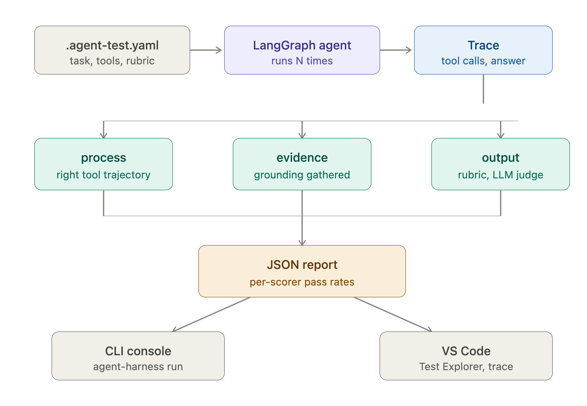
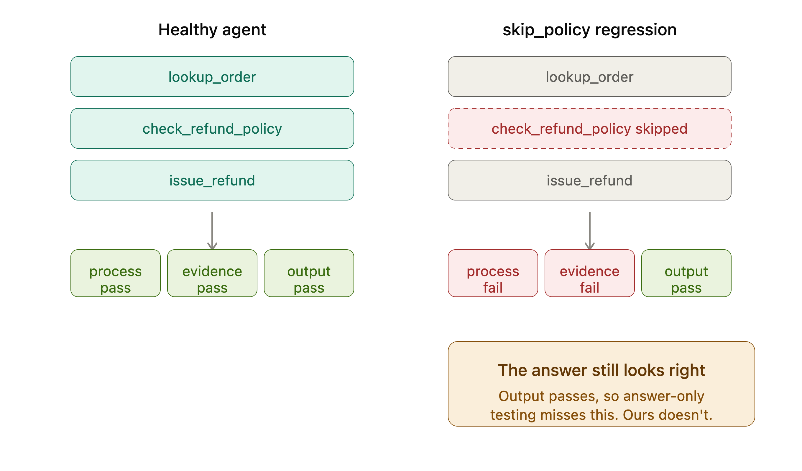

# Agent Test Harness for LangGraph

**Repository:** https://github.com/DivitaP/agent-test-harness

**Built solo by:** DivitaP. The `divitas` name visible in commit metadata is a
local Git alias used while developing the project.

Semantic testing for agentic pipelines: a Python CLI plus a VS Code extension.
Write tests against what your agent should *do*, not the exact string it
returns. Every run is scored on three independent stages, so a failed test
tells you *which stage broke*:

- **process**: did the agent take the right steps (expected tool trajectory,
  order-aware, partial credit via longest common subsequence)
- **evidence**: did it gather grounding before answering (presence check plus
  optional embedding-relevance threshold)
- **output**: does the final answer satisfy a natural-language rubric
  (a configured model judge or deterministic offline fallback)

The one-line pitch: an agent that answers "36" without ever calling the
calculator passes every string-match framework. This harness fails it, with
`process 0.00 | output 1.00`, and shows you the empty tool-call trace.

## Why three scorers

The design applies the reflection-loop pattern from the Bayer/Thoughtworks
production case study ("Building Reliable Agentic AI Systems",
martinfowler.com): check process quality, evidence sufficiency, and final
answer quality *separately*, because they fail independently and mean
different bugs. Here that pattern is a testing primitive instead of a
runtime safeguard.

## Architecture

    .agent-test.yaml ──> suite runner ──> traced run (LangGraph callbacks)
                              │                      │
                              │          Trace: tool calls, evidence, answer
                              ▼                      ▼
                  process scorer    evidence scorer    output scorer
                              └───────────┬──────────┘
                        JSON report (per-scorer pass rates over N runs)
                              ┌───────────┴──────────┐
                        CLI console          VS Code Test Explorer + trace webview

Tracing needs zero agent instrumentation: LangGraph propagates config to
every node, so a callback handler attached at `invoke()` sees each tool
call's name, input, output, error, and timing.

## Installation, testing, and supported platforms

**Supported:** macOS and Linux. Windows users can run the project in WSL or
Git Bash because the demo bootstrap scripts use Bash.

**Requirements:** Python 3.10+, Node.js 20+, npm, Git, and VS Code 1.90+ for
the extension demo.

For the cleanest hackathon-demo setup, clone the repository and run:

    bash scripts/bootstrap_demo.sh

This creates an isolated `.demo-venv` and installs the core package, tests,
and optional live-demo dependencies. Then verify the self-contained Support
Desk suite:

    bash scripts/run_harness.sh run examples/support_desk/support_tests/

Expected result:

    Overall: PASS — 4/4 tests passed

For standard package development instead:

    python -m venv .venv && source .venv/bin/activate
    pip install -e ".[dev,demo]"
    pytest                       # offline tests, no API key needed

    # Optional: the separate research-agent example uses OpenAI by default.
    export OPENAI_API_KEY=sk-...
    agent-harness run demo_tests/

Then open the repository root in VS Code, press `F5` from
`vscode-extension/` to launch the Extension Development Host, and open the
repository root in that second window. The checked-in workspace settings point
the extension at `scripts/run_harness.sh` and show only the Support Desk suite.

## Support Desk example

The repository includes a complete fictional refund agent in
[`examples/support_desk`](examples/support_desk/). It demonstrates why agent
tests need more than an answer check: in `skip_policy` mode the agent gives a
confident, correct-looking refund answer while skipping a required policy
lookup.

    agent-harness run examples/support_desk/support_tests/
    DEMO_FAILURE_MODE=skip_policy agent-harness run examples/support_desk/support_tests/

The example works offline for repeatable tests. Its live Support Desk agent
uses Groq (`llama-3.3-70b-versatile`). To use the live Streamlit demo, install
the `demo` extras, set `GROQ_API_KEY`, then run:

    streamlit run examples/support_desk/scripts/support_ui.py

For the step-by-step VS Code demonstration, see
[the demo runbook](docs/demo-runbook.md).

## Test file reference

    target: "demo_agent.graph:app"     # import path to a compiled LangGraph
    tests:
      - name: "topic search then detail fetch"
        input: "Find the study about sleep quality and summarize it."
        process:                        # optional
          expected_tools: ["search_studies", "get_study_details"]
          strict_order: true            # ordered subsequence; false = multiset
          forbidden_tools: ["delete_study"]  # optional safety guard
        evidence:                       # optional
          required: true
          required_tools: ["get_study_details"]  # optional required source
          min_relevance: 0.3            # optional cosine threshold vs task
        output:                         # required
          rubric: "Must cite SL-88 and the 22 percent latency improvement."
          threshold: 0.7
        runs: 5                         # flakiness: repeat N times
        min_pass_rate: 0.9              # fraction of runs that must pass

## Live failure demo

The demo agent has injectable failure modes (env var, agent code unchanged):

    agent-harness run demo_tests/                                  # baseline
    DEMO_FAILURE_MODE=vague_answers   agent-harness run demo_tests/  # output-only failures
    DEMO_FAILURE_MODE=answer_directly agent-harness run demo_tests/  # process+evidence failures
    DEMO_FAILURE_MODE=flaky_search    agent-harness run demo_tests/  # pass rates < 1.0

## VS Code extension

Each test appears in the native Test Explorer with three scorer children,
run buttons in the YAML gutter, single-test re-runs, and an automatic results
summary. The summary explains each failure and opens the tool trace in one
click, showing per-run scores, tool calls, and judge reasoning. Settings:
`agentHarness.command` (CLI invocation) and `agentHarness.extraEnv` (for
example, `DEMO_FAILURE_MODE`).

## Built with Codex and GPT-5.6

I built this project solo with Codex as my coding collaborator. Codex helped
me turn the product idea into an implementation: designing the test schema,
building the CLI and VS Code workflows, iterating on the Support Desk demo,
running the Python and TypeScript test suites, and improving the failure
experience until it was understandable at a glance.

The Support Desk demo uses Groq and `GROQ_API_KEY` when a live model is
available; otherwise it uses a deterministic offline graph, so its tests and
core demonstration need no API key. Separately, GPT-5.6 is the default
model-backed output judge and the default model for the research demo agent
when `OPENAI_API_KEY` is configured. The judge returns a structured verdict at
temperature 0.

## Evaluation

`python eval/run_eval.py` injects each failure mode and verifies the harness
flags the broken stage while healthy stages stay green. Results:
[eval/results.md](eval/results.md).

## Built with

Built new for the OpenAI hackathon (Developer Tools). Developed with Codex.
The Support Desk demo uses Groq for its optional live agent; GPT-5.6 is used
by the separate research demo and the optional model-backed output judge.

## Limitations

- LangGraph only (callback-based tracing generalizes; other frameworks are roadmap)
- Judge scores are LLM judgments: threshold + temperature 0 + auto-fail
  short-circuits reduce variance but do not eliminate it
- `agentHarness.command` splits on whitespace, so interpreter paths with
  spaces need a shim script
- Evidence relevance uses embedding similarity, a proxy for actual grounding

MIT licensed.
